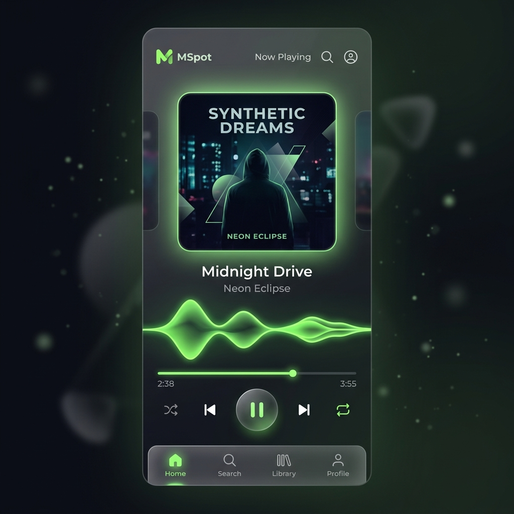

# 🎵 okotunes — Ultra-Fast Personal Music Streamer



**okotunes** is a high-performance, containerized personal web-based music streaming service designed for deployment on **Render** backed by **Cloudflare R2** for zero-egress audio streaming and **SQLite** for ultra-fast database metadata querying.

---

## 🚀 Key Highlights & Architecture

- **Cloudflare R2 Audio Streaming**: Songs stream directly from Cloudflare R2's global edge network (zero egress fees, instant byte-range HTTP seeking).
- **Embedded SQLite Database**: Lightweight `okotunes.sqlite` database stored on a Render Persistent Disk with zero network latency.
- **Docker Containerized**: Built with PHP 8.2 & Apache, ready for 1-click Render blueprint deployment (`render.yaml`).
- **Spatial Audio & DSP Engine**: Built-in 3D binaural positioning, virtual surround 5.1/7.1, concert hall reverb, and dynamic range compression via Web Audio API.
- **Desktop & Mobile Responsive**: Glassmorphic UI tailored for both desktop studio workstations and mobile thumb navigation.

---

## 🛠 Deployment & Setup

### Environment Variables (Render / Docker)
Set the following environment variables in your Render Web Service or `.env` file:

```env
R2_ACCOUNT_ID=your_cloudflare_account_id
R2_ACCESS_KEY_ID=your_r2_access_key_id
R2_SECRET_ACCESS_KEY=your_r2_secret_access_key
R2_BUCKET_NAME=okotunes
R2_PUBLIC_URL=https://pub-xxxx.r2.dev
```

### Local Docker Build & Test
```bash
docker build -t okotunes .
docker run -p 8080:80 --env-file .env okotunes
```
Open `http://localhost:8080` in your web browser.
